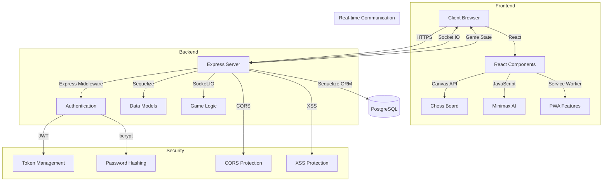

# Chess Game System Architecture

## System Overview



## Component Details

### Frontend Components
1. **React Application**
   - Single Page Application
   - Responsive design
   - Semantic HTML5
   - ARIA attributes for accessibility

2. **Chess Board**
   - Canvas API implementation
   - Move validation
   - Visual feedback
   - Click-based movement

3. **Chess AI**
   - JavaScript-based minimax algorithm
   - Alpha-beta pruning
   - Move calculation
   - Position evaluation

4. **PWA Features**
   - Basic Service Worker
   - Simple offline support
   - Installable on devices
   - Basic cache management

### Backend Components
1. **Express Server**
   - RESTful API endpoints
   - Socket.IO server
   - Static file serving
   - Error handling

2. **Authentication**
   - JWT token management
   - Cookie-based sessions
   - User registration/login
   - Password hashing with bcrypt

3. **Data Models**
   - User model
   - Game model
   - Sequelize ORM
   - PostgreSQL database

4. **Game Logic**
   - Move validation
   - Game state management
   - Turn management
   - Win condition checking

### Security Features
1. **HTTPS**
   - SSL/TLS encryption
   - Secure cookie handling
   - Certificate management

2. **CORS Protection**
   - Origin validation
   - Method restrictions
   - Header management

3. **XSS Protection**
   - Input sanitization
   - Output encoding
   - Content Security Policy

4. **CSRF Protection**
   - Token validation
   - Same-origin policy
   - Cookie security

## Data Flow

1. **User Authentication**
   ```
   Client -> Server: Login/Register Request
   Server -> Database: Validate Credentials
   Database -> Server: User Data
   Server -> Client: JWT Token
   ```

2. **Game Creation**
   ```
   Client -> Server: Create Game Request
   Server -> Database: Store Game
   Database -> Server: Game ID
   Server -> Client: Game Details
   ```

3. **Move Processing**
   ```
   Client -> Server: Move Request
   Server -> Database: Validate Move
   Database -> Server: Updated Game State
   Server -> Client: Move Result
   ```

4. **AI Move Generation**
   ```
   Client -> JavaScript: Position Data
   JavaScript -> Client: Calculated Move
   Client -> Server: AI Move
   Server -> Database: Update Game
   ```

## Security Measures

1. **Authentication**
   - JWT tokens for session management
   - Secure cookie storage
   - Password hashing with bcrypt
   - Token expiration and refresh

2. **Data Protection**
   - Input validation
   - Output sanitization
   - SQL injection prevention via Sequelize
   - XSS protection via React

3. **API Security**
   - Rate limiting
   - Request validation
   - Error handling
   - CORS configuration

4. **PWA Security**
   - Service Worker scope
   - Cache validation
   - Basic offline data protection
   - Update management 